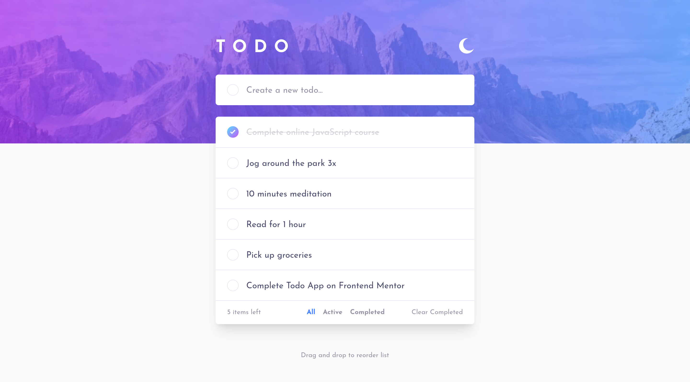

# Frontend Mentor - Todo app solution

This is a solution to the [Todo app challenge on Frontend Mentor](https://www.frontendmentor.io/challenges/todo-app-Su1_KokOW). Frontend Mentor challenges help you improve your coding skills by building realistic projects.

## Table of contents

- [Overview](#overview)
  - [The challenge](#the-challenge)
  - [Screenshot](#screenshot)
  - [Links](#links)
- [My process](#my-process)
  - [Built with](#built-with)
  - [What I learned](#what-i-learned)
  - [Useful resources](#useful-resources)
- [Author](#author)

## Overview

### The challenge

Users should be able to:

- View the optimal layout for the app depending on their device's screen size
- See hover states for all interactive elements on the page
- Add new todos to the list
- Mark todos as complete
- Delete todos from the list
- Filter by all/active/complete todos
- Clear all completed todos
- Toggle light and dark mode
- Drag and drop to reorder items on the list

### Screenshot

### Links

- Live Site URL: [GitHub Pages](https://danayatsuta.github.io/frontend-mentor-todo-app/)

## My process

### Built with

- [Vue.js](https://vuejs.org/)
- [Vite](https://vitejs.dev/)
- [Tailwind CSS](https://tailwindcss.com/)
- [Prettier](https://prettier.io/) (including [plugin for Tailwind](https://github.com/tailwindlabs/prettier-plugin-tailwindcss))
- [ESLint](https://eslint.org/)

### What I learned

- How to implement dark mode with Tailwind CSS
- How to manipulate element's position depending on screen size
- How to implement drag events
- How to use state management in Vue

### Useful resources

- [Vite documentation on deploying to GitHub Pages](https://vitejs.dev/guide/static-deploy.html#github-pages) - much simpler way to deploy Vite projects on GitHub Pages instead of manually rebuilding and reuploading `dist` folder
- [MDN documentation on drag and drop events](https://developer.mozilla.org/en-US/docs/Web/API/HTML_Drag_and_Drop_API) - very helpful resource for understanding how to implement drag events
- [Stack Overflow question on dragleave activating when hovering over parent's children](https://stackoverflow.com/questions/7110353/html5-dragleave-fired-when-hovering-a-child-element) - answers were helpful in identifying and fixing the issue in the title

## Author

- Frontend Mentor - [@danaYatsuta](https://www.frontendmentor.io/profile/danaYatsuta)
